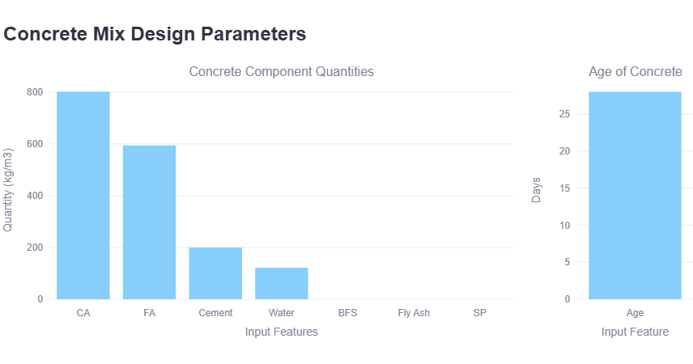
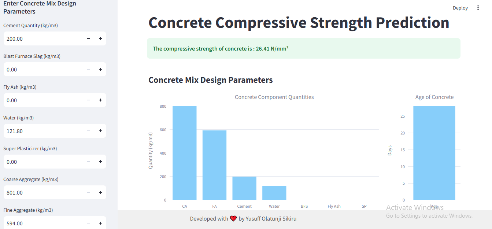

---

# Concrete Compressive Strength Prediction

This project aims to predict the compressive strength of concrete based on its mix design. It utilizes a Gradient Boosting Regressor model trained on a dataset containing various features related to concrete composition.

## About

The prediction model is trained on a dataset consisting of features such as cement quantity, blast furnace slag, fly ash, water content, superplasticizer, coarse aggregate, fine aggregate, and the age of the concrete. The model predicts the compressive strength of concrete in N/mm².

## Installation

To run the project locally, follow these steps:

1. Clone the repository:

```bash
git clone https://github.com/your-username/concrete-compressive-strength-prediction-app.git
```

2. Navigate to the project directory:

```bash
cd concrete-compressive-strength-prediction-app
```

3. Install the required dependencies:

```bash
pip install -r requirements.txt
```

4. Run the Streamlit app:

```bash
streamlit run app.py
```

## Usage

Once the Streamlit app is running, you can enter the concrete mix design parameters in the sidebar and click the "Predict Concrete Compressive Strength" button to see the predicted compressive strength of the concrete.

## Data

The dataset used for training the model is not provided in this repository. However, you can use your own dataset with similar features to train your own model.


 
---

